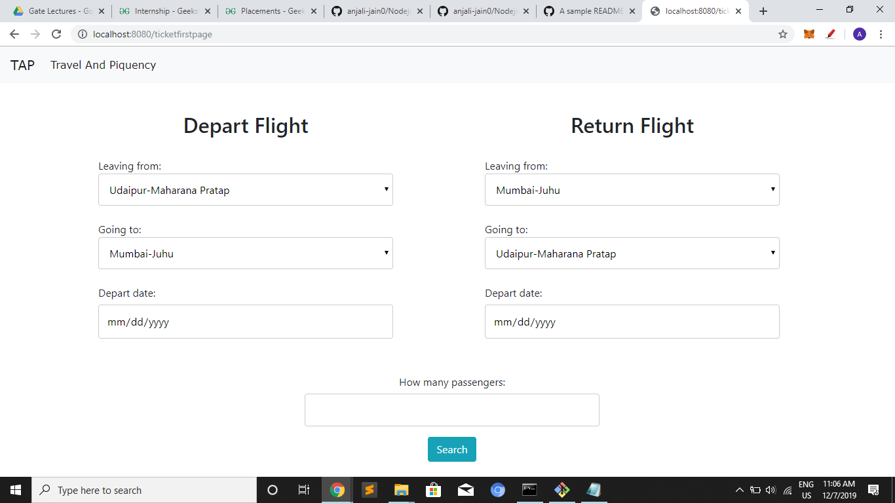
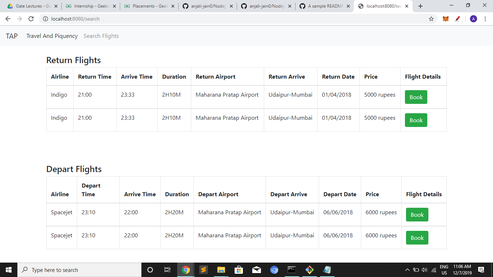
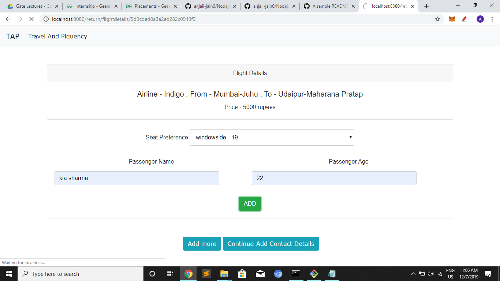
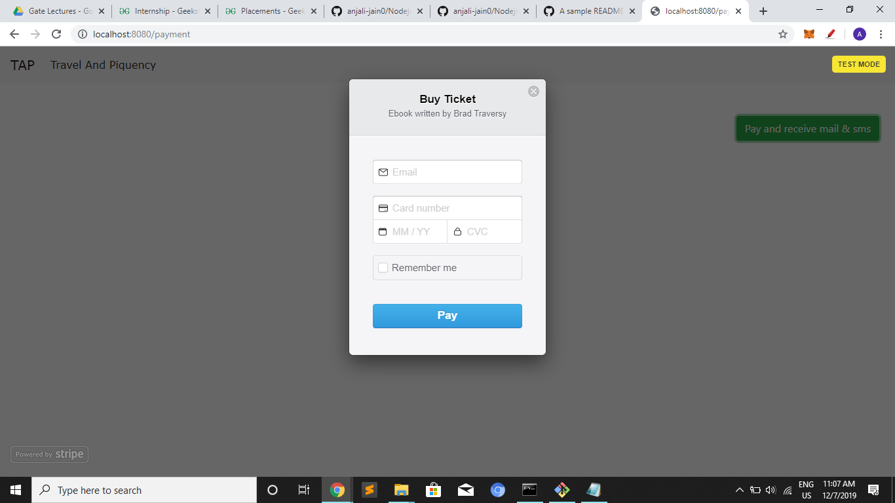

# Nodejs_Get_Ur_Flight_Tickets

Web App that allows users to book flight tickets online.

## Description
This is a web app that helps you to search for and book available flight tickets online according to location and date. When input departure/return location and date is submitted, the api is called and displays available flights.

## Features
* Search for flights availability by depart/return location and date.
* Book tickets from available according to your preferences and submit passenger details.
* View and check your information and tickets.
* Payment Portal
* Check your bookings and cancel, ask for refund.

## Setup/Installation Requirements
* Download or clone git repo at https://github.com/anjali-jain0/Nodejs_Get_Ur_Flight_Tickets.git
* Run npm install
* Run node index.js
* Index.js should open up on your default browser, if not, go to localhost:8080

## Screenshots
       

## Technologies Used
* HTML/CSS
* Javascript
* Jquery/Bootstrap
* NodeJS with Express(ejs template engine)
* Mongodb
